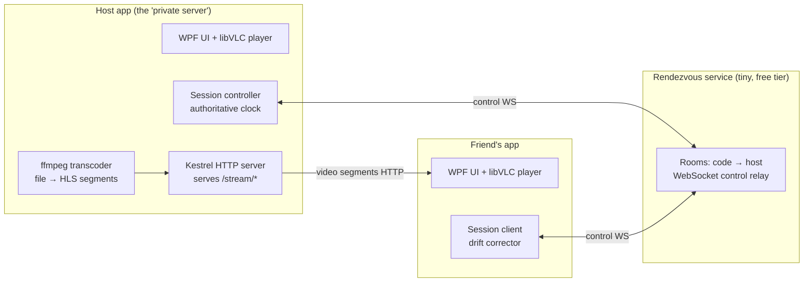

# Video Player v2 — C# Rewrite & Watch-Together Plan

**Goal:** a Windows-native C# app that does everything v1 does, runs better, and adds the
headline feature: **watching movies together with friends who run the same app** — the host
"runs the server" (like a game's private server) and streams the movie; friends join with a
room code and everyone stays in perfect sync.

---

## 1. Decisions already made

| Decision | Choice | Why |
|---|---|---|
| Language / runtime | C# on .NET (latest LTS) | User choice; native Windows performance |
| Platforms | **Windows only** | All friends run Windows; frees us to use the most mature stack |
| Movie source in sessions | **Host streams it** | Friends don't need the file; host = private server operator |
| Helper server | **Yes, tiny rendezvous service** | Room-code invites, no router configuration for friends |

## 2. Tech stack (proposed)

| Layer | Technology | Notes |
|---|---|---|
| UI | **WPF** | Most mature C# desktop framework; huge ecosystem; MVVM |
| Video playback | **LibVLCSharp** (libVLC embedded) | Plays *everything* natively — MKV, DTS, AC-3, HEVC, embedded subtitle tracks, multiple audio tracks. **Kills v1's entire convert/stream-to-self pipeline** — local playback is instant for every format, no ffmpeg needed to just watch |
| Probing & thumbnails | **ffmpeg / ffprobe** (bundled, same binaries as v1) | Fast-seek frame grabs for the library; codec probe for the streaming ladder |
| Outbound streaming | **ffmpeg → HLS** (2s segments) served by **embedded Kestrel** (ASP.NET Core's web server, built into .NET) | Host transcodes to H.264/AAC once; every viewer pulls the same segments |
| Library / recents / settings | **SQLite** (Microsoft.Data.Sqlite) | Real database instead of v1's localStorage — survives anything, queryable |
| Rendezvous server | **ASP.NET Core minimal API + WebSockets** | ~300 lines; runs on any free/cheap tier. Rooms, presence, control-message relay |
| Installer & updates | **Velopack** | Proper installer AND delta auto-updates — v2 improvement over v1's plain NSIS |

Licensing: libVLC is LGPL (fine when dynamically linked, which LibVLCSharp does);
ffmpeg GPL build is fine to redistribute with the app as a separate executable.

## 3. Architecture



- **Control plane** (play/pause/seek/roster/chat): always relayed through the rendezvous
  WebSocket. Tiny bandwidth, works through every NAT, no configuration.
- **Media plane** (the actual video): friends pull HLS directly from the host's Kestrel.
  - Connection order: try direct (host auto-opens a port via UPnP; rendezvous tells friends
    the host's public IP) → if unreachable, fall back to relaying segments through the
    rendezvous server (works everywhere, but costs server bandwidth — acceptable for
    a friends-scale app, monitored).

## 4. Watch-together design (the core feature)

**Session model — "private server":**
1. Host picks a movie → clicks **Host session** → app starts ffmpeg + Kestrel, registers
   with rendezvous, gets a room code like `MOVIE-4287`.
2. Friends click **Join session**, type the code, land in the lobby (roster shows who's in).
3. Host presses play when everyone's buffered (apps report readiness automatically).
4. Host's controls are authoritative: play, pause, seek apply to everyone.
5. **Guests can REQUEST a pause** (user requirement): a guest's pause button sends a
   request; the host sees a toast ("Sam asked to pause") with one-click approve, plus a
   host setting to auto-approve pause requests (game-server style permissions).

**Sync protocol** (JSON over the control WebSocket):
- Host broadcasts a state beacon every 2s: `{ playing, positionMs, hostClockMs }`.
- Clients estimate clock offset NTP-style (RTT/2) and compare their player position.
- Drift < 150 ms: ignore. Drift 150 ms–2 s: nudge playback rate ±3% until aligned
  (inaudible, invisible). Drift > 2 s (or after seek): hard-seek to target.
- Seeks restart the host's ffmpeg at the target (v1 taught us this pattern well) and
  broadcast the new position; clients re-anchor.

**Streaming ladder (phase-in):**
- v2.0: single quality — 1080p max, H.264 veryfast, CRF-capped ~6 Mbps, AAC stereo.
  Host upload bandwidth is the real constraint: each viewer costs the full bitrate.
  3 friends × 6 Mbps = 18 Mbps upload — fine on fiber, tight on cable. The app will
  measure and warn, with a bitrate slider (quality vs. friend count).
- Later: relay fan-out (host uploads once to relay, relay serves N friends) and/or a
  lower-bitrate rung.

**Subtitles in sessions:** host burns selected subtitles into the stream (simplest,
always correct) — v2.1 can send the subtitle track separately for client-side rendering.

## 5. Feature parity + improvements over v1

Parity (all exist in v1, must exist in v2): folder library • thumbnails • search & sort •
recents / continue-watching with resume • sidecar SRT/VTT subtitles • playback modes
(autoplay-next / loop one / loop all / once) • speed dropdown • ±10sec • scrub preview
bubble • centered translucent playback options • keyboard shortcuts • app icon.

Improvements v1 can't easily do (come free or cheap with the native stack):
- **Instant local playback of every format** — no conversion, ever (libVLC decodes DTS/AC-3/HEVC directly)
- **Cast to devices** — Chromecast / Google TV via libVLC's built-in renderer support
  (discovery + session + automatic transcode when the TV can't decode, e.g. DTS).
  DLNA smart-TVs come later, served by the same media server the watch-party host runs
- **Embedded subtitle & audio tracks** in MKVs (track picker — v1 only did sidecar files)
- Hardware-accelerated decode everywhere, lower idle CPU/RAM than Electron
- Real DB for the library (fast startup with thousands of files, folder watching)
- Media-key / taskbar controls, remember window size & position
- **Auto-updates** via Velopack — ship fixes to friends without re-sending installers

## 6. Phases

| Phase | Deliverable | Size |
|---|---|---|
| **0 — Spike** | WPF window + LibVLCSharp playing the user's real MKVs (DTS audio, seek, tracks). Proves the whole codec story in a day | S |
| **1 — Player parity** | Full player UI: controls, modes, speed, subtitles, shortcuts, scrub bubble | M |
| **2 — Library parity** | SQLite library, thumbnails, search/sort, recents/resume, settings | M |
| **3 — Streaming core** | Host-side ffmpeg→HLS→Kestrel; a second instance on the LAN plays it in sync (no internet yet) | M |
| **4 — Rendezvous & rooms** | Cloud service, room codes, control relay, UPnP + relay fallback, lobby/roster UI | L |
| **5 — Session polish** | Reconnect handling, buffering states, host bitrate control, guest permissions, text chat overlay | M |
| **6 — Ship** | Velopack installer + auto-update channel, friends install & first real movie night | S |

**Distribution:** users download and install directly from the owner's website. Velopack fits
this exactly — a release is a folder of static files (`Setup.exe` + delta packages + a
`releases` manifest) uploaded to the site; installed apps check that same URL and
auto-update. No store, no accounts. (Code-signing certificate is optional but removes the
SmartScreen warning for downloaders — decide before public release.) Website work itself is
deliberately out of scope until the app is built.

Sequencing note: phases 0–2 replace v1 for solo use; 3–5 are the new feature. Each phase
ends runnable — no long dark stretches.

## 7. Risks & honest caveats

- **Host upload bandwidth** is the hard physical limit. The app must surface it clearly
  (pre-session speed check, per-friend cost meter) instead of letting sessions stutter mysteriously.
- **Relay bandwidth costs** if direct connection fails often — start free-tier, watch usage.
- **Voice chat is out of scope** — Discord does it better; the plan is to coexist, not compete.
- **WPF + libVLC airspace quirks** (overlaying controls on video) are well-trodden but fiddly —
  phase 0 deliberately proves this early.
- v1 stays installed and working the whole time; v2 replaces it only when it's actually better.

## 8. Repo layout (new solution, same repository)

```
v2/
  VideoPlayer.sln
  src/App/            WPF app (player, library, session client & host)
  src/Rendezvous/     ASP.NET Core rendezvous service
  src/Protocol/       shared message contracts (class lib)
  tools/              ffmpeg/ffprobe binaries (reused from v1 pipeline)
```
